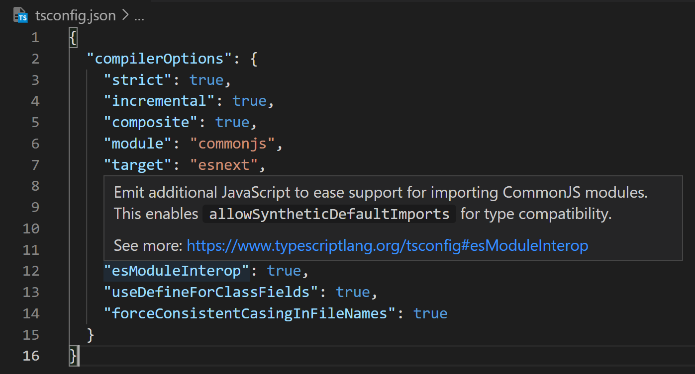
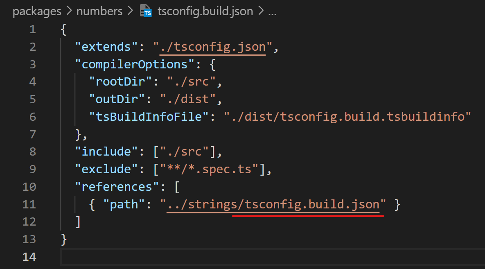

# Config

_What are all these things? Why are they here?_

This is a multi-project repository, sometimes called a monorepo. It contains a set of packages that are convient to develop, test, and publish together. We have reached a stage in the available tooling where this can go smoothly, but the cost is a high number of configuration files. To leave nothing to mystery, every single file is noted and described here.

Some configuration files are present only in the root repository (e.g [`.prettierrc`](#prettierrc), [`pnpm-lock.yaml`](#pnpm-lockyaml)), and affect all projects in the repo. Other have base settings defined in the repo root which are then imported and extended in each individual project  (e.g [`jest.config.js` (root)](#jestconfigjs-root) / [`jest.config.js`](#jestconfigjs)). Finally, some files exist only in each project directory (e.g. [`tsconfig.build.js`](#tsconfigbuildjs)). See below for details of each configuration file:
 
- [Repo root](#repo-root)
  - [`.eslintrc.cjs`](#eslintrccjs-root)
  - [`.gitignore`](#gitignore)
  - [`.prettierrc`](#prettierrc)
  - [`jest.config.js`](#jestconfigjs-root)
  - [`package.json`](#packagejson-root)
  - [`pnpm-lock.yaml`](#pnpm-lockyaml)
  - [`pnpm-workspace.yaml`](#pnpm-workspaceyaml)
  - [`tsconfig.json`](#tsconfigjson-root)
- [Each package](#each-package)
  - [`.eslintrc.cjs`](#eslintrcjs) 
  - [`jest.config.js`](#jestconfigjs)
  - [`package.json`](#packagejson)
  - [`tsconfig.build.json`](#tsconfigbuildjson)
  - [`tsconfig.eslint.json`](#tsconfigeslintjson)
  - [`tsconfig.json`](#tsconfigjson)
 
# Repo root
 
### `.eslintrc.cjs` (root)

[ES Lint](https://eslint.org/) is the dominant [linter](<https://en.wikipedia.org/wiki/Lint_(software)>) for both JavaScript and TypeScript. ES Lint has numerous rules which can be configured, and `.eslintrc.cjs` files describe which rules to use and how. ES Lint is invoked during development and build steps to ensure code consistency and correctness. With the [right extensions](./SETUP.md#vs-code-extensions) ES Lint is also well integrated into VS Code, so that linting errors can be seen and fixed live while writing code. 

The repo [root `.eslintrc.cjs`](./.eslintrc.cjs) includes most of the linting settings applied throughout the repository. Each package does include its own [`.eslintrc.cjs`](#eslintrcjs) which imports the root config and adds a few items to ensure TypeScript and ESLint work well together.

This file uses the `.cjs` extension (for **c**ommon JS) to indicate to the tooling that it uses traditional CommonJS module syntax on purpose, even though linting settings otherwise require ESM module syntax.

### `.gitignore`

This file tells git which files to NOT include in source control. For this project the obvious items are the standard exclusion of `node_modules` and the intentional choice to _include_ the `.vscode` folder, because it includes [settings that make linting work](#vs-code-settings-json) well and which we want to share between all developers working on the project.
 
### `.prettierrc`

[Prettier](https://prettier.io/docs/en/index.html) is a library focused exclusively on ergonomic *formatting* of JavaScript, HTML, JSON, YAML, and a variety of other common file formats used in frontend work. Unlike ESLint, it strives to *just work*, with minimal config required or even offered. We do use just three options:

|Setting|Effect|
|-|-|
|`"semi": true`|Ensure our use of semicolons (or not) is consistent across projects.|
|`"singleQuote": true`|Ensure our use of single quotes (or not) is consistent across projects.|
|`"endOfLine":"auto"`|Tell prettier to use the right line breaks for the platform (`\n` for *nix, `\r\n` for windows).|
 
### `jest.config.js` (root)

[Jest](https://jestjs.io/docs) is a test framework runner. It uses the familiar `describe`, `it` pattern for structuring tests and the `expect(...).to__` pattern for making assertions. Where earlier projects often required you to assemble and plug together your own set of tools for testing (`mocha` for test runner, `chai` for assertions, `istanbul` for coverage reports...), Jest brings all the necessary parts to the table and generally just works. 

At the repo root, we add just one setting:

|Setting|Effect|
|-|-|
|`preset: 'ts-jest'`|Jest understands TypeScript|

Each project also includes a [`jest.config.js`](#jestconfigjs) which ensures the local [path aliases](./SETUP.md#path-aliases) in each project work when running Jest tests.

### `package.json` (root)

This is the description of the overall repository, used by all JavaScript package managers (`npm`, `yarn`, and `pnpm`). It includes metadata about the repository and lists the dependencies needed to build, test, and run the projects in it. Finally, it includes scripts that can be used in the development process. See [`package.json` docs](https://docs.npmjs.com/files/package.json.html) for more details. As noted in the [SETUP](./SETUP.md), we use `pnpm` in this project for package management (`pnpm install`) and for workflow scripts (`pnpx jest`, `pnpm test`, etc.).

This repo root `package.json` should have no `dependencies`, becuase it does not produce a actual package to deploy. It **should** include any and all `devDependencies` for the entire repo.

### `pnpm-lock.yaml`

As noted in the [SETUP](./SETUP.md#quick-start), this project use **pnpm** instead of **npm** for package management. `pnpm-lock.yaml` is the file that pnpm uses to keep track of the exact version of any downstream dependencies that are installed.
 
### `pnpm-workspace.yaml`

This file enables `pnpm`'s [workspace features](./SETUP.md#pnpm-workspaces). The only thing we need to include are the paths to where our individual packages are. All of our packages are in the `packages` folder, so the entire config file is this:

```yaml
packages:
  - 'packages/*'
```
 
### `tsconfig.json` (root)

The essential configuration file for the TypeScript compiler and tooling. The [root `tsconfig.json`](./tsconfig.json) includes settings to be used in all the projects in this repository. 

Each project also has a [`tsconfig.js`](#tsconfigjs) which is used to declare local [path aliases](./SETUP.md#path-aliases) and define which files to include in compilation of each individual project.

VS Code includes built-in intellisense hints for tsconfig files. To learn what any setting does, just hover over the property name, then click the link in the info box:


 
# Each package

### `.eslintrc.cjs`
 
Each package includes its own `.eslintrc.cjs`  which imports the [root `.eslintrc.cjs`](#eslintrcjs-root) and adds a few items to ensure TypeScript and ESLint work well together.

|Setting|Effect|
|-|-|
|`extends: '../../.eslintrc.cjs'`|Inherit all the configuration from the [root `.eslintrc.cjs`](#eslintrcjs-root)| 
|`parserOptions: { ... }`|Ensure ESLint and TypeScript work well together within this package directory|

### `jest.config.js`

Each project also includes a `jest.config.js` which ensures the local [path aliases](./SETUP.md#path-aliases) in each project work when running Jest tests.

|Setting|Effect|
|-|-|
|`...base,`|Inherit everything from the [root `jest.config.js`](#jestconfigjs-root)|
|`moduleNameMapper: { ... }`|Define the local [path aliases](./SETUP.md#path-aliases) for the project in a way that Jest understands|
 
### `package.json`

The `package.json` file for each project is essential. Each project is intended to be published on its own, so each project's `package.json` must contain the full metadata about the project as well as its complete list of **runtime** dependencies. Individual project `package.json` files generally do **not** need to contain any `devDependencies`. A primary purpose of using the monorepo tools we use here is to avoid that. Instead, we just have a single version of our dev tools like `eslint`, `jest`, and even `typescript` installed in the repo root. The tools all work natively on any of the projects within the repo, respecting the local settings of each project.

The most important point to remember here is to use the `workspace:*` psuedo-version for any dependencies to other packages within this same repository (see [pnpm workspaces](./SETUP.md/#pnpm-workspaces)):

```json
"dependencies": {
  "@example/strings": "workspace:*",
  ...
}
```

### `tsconfig.build.json`

This variation imports and adjusts the settings in `tsconfig.js` to a configuration suited for **building**, which means compiling the *.ts source files in the `src/` directory of the applicable project, and writing the resulting `.js`, `.js.map`, `.d.ts`, and `.d.ts.map` files to the local `dist` folder for the project. The contents of `dist` are never checked in to source control, but they are included in the published npm package for each project.

**NOTE** : Project references in the applicable `tsconfig.build.json` also refer specifically to the `tsconfig.build.json` file of referenced projects:



### `tsconfig.eslint.json`

A slight variation of `tsconfig.json` that tells ESLint to also lint the JavaScript configuration files `.eslintrc.cjs` and `jest.config.js`. If we don't do this, ESLint will complain because it will notice those files but also note that they are not included for compilation by the typescript project as described in `tsconfig.json`.

### `tsconfig.json`

The `tsconfig.json` in each project directory imports and extends the [root `tsconfig.json`](#tsconfigjson-root) and includes the following items that are unique to each project:

|Setting|Effect|
|-|-|
|`compilerOptions.baseUrl: "."`|Relative file path imports within this project directory should be resolved relative to the same directory in which this `tsconfig.json` file is stored
|`compilerOptions.paths: {...}`|Configuration of [path aliases](./SETUP.md#path-aliases) for the project|
|`include: ["./src", "./test"]`|Include both `./src` and `./test` directories for compilation and **tooling support**. Note that the `tsconfig.build.json` configuration used to **build** the project does not include the test files.|
|`references: [ ... ]`|The TypeScript [project references](./SETUP.md#typescript-project-references) for the project.|