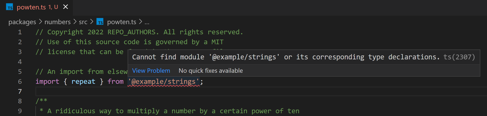

# Multi Package TypeScript Template

This repo contains a standard template project for a developing multiple TypeScript library packages in the same repository.

## How to use this template

1. Install `degit`:

    ```sh
    npm i -g degit
    ```

2. Clone the repo. Using `degit` gets you the repo content without the git history:

    ```sh
    degit https://github.com/libsabl/template-ts-lib-multi my-project
    git init my-project
    ```

3. Replace `name`, `description`, and `contributors` in `package.json`.

4. Update copyright year / holder in [LICENSE](./LICENSE) and LICENSE_HEADER, which is a sample
for a standard copyright notice to include at the top of new code files. For convenience, you
can global find/replace the string `REPO_AUTHORS`.

5. See [SETUP.md](./SETUP.md) and try out the tooling from the command line and in VS Code.

6. Rename the package folders according to you actual package names, replace the respective `/src` and `/test` files with your actual code, and add new package directories as applicable.

7. **UPDATE THE PATHS TO EACH PACKAGE's jest.config.js file** in [.vscode/settings.json](./.vscode/settings.json) in the `"jest.jestCommandLine"` property. If you add additional packages, you will also need to add an applicable entry here so that the [Jest](vscode:extension/orta.vscode-jest) extension works.

## Developer setup

Error `ts(2307)`? See [**Fix error ts(2307)**](./SETUP.md#fix-error-ts2307):




See [SETUP.md](./SETUP.md), [CONFIG.md](./CONFIG.md).
