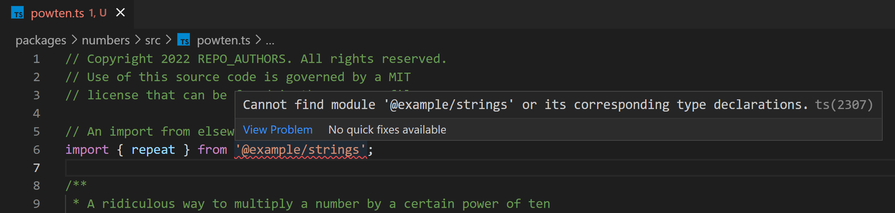
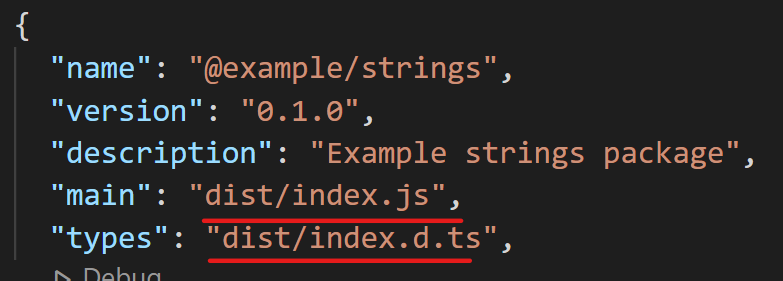

# Setup

## Quick-start

For the impatient. But **please** see [Tooling](#tooling), [Key concepts](#key-concepts), and [Repo structure](#repo-structure). For even more detail about all the individual configuration files, see [CONFIG.md](./CONFIG.md).

### **You must install `pnpm` and `pwsh` to work with this project.**

#### **1. Install pnmp**

Install `pnpm` if you don't already have it

**Mac**
```sh
brew install pnpm
```

**Win**

```powershell
# Pwsh / Powershell:
iwr https://get.pnpm.io/install.ps1 -useb | iex
```

**Linux / other**

```sh
curl -fsSL https://get.pnpm.io/install.sh | sh -
```

#### **2. Install pwsh**

Install `pwsh` if you don't already have it.

> Q: *pwsh?? Why aren't you using [bash/ruby/perl/etc]?*
>
> A: `pwsh` is mature, open-source, and cross-platform compatible, but a heck of a lot easier to write loops and manipulate data than shell/bash/zsh. Want to re-implement the tooling in `/.scripts` in either Node or shell? Great! PRs welcome at https://github.com/libsabl/template-ts-lib-multi.

**Mac**
```sh
brew install pwsh
```

**Win**

Download and run the MSI installer. See [docs](https://docs.microsoft.com/en-us/powershell/scripting/install/installing-powershell-on-windows?view=powershell-7.2#msi).

**Linux / other**

See [docs](https://docs.microsoft.com/en-us/powershell/scripting/install/installing-powershell-on-linux) for installing on Linux.

### Restore packages

```bash
pnpm install  # DO NOT USE npm!!
```
## Commands

### Clean
Deletes `dist`, `coverage`, and `publish` folders

```bash
# From root directory:
# Clean the repo root and all packages
./> pnpm clean

# From a specific package directory:
# Clean this package (numbers)
./packages/numbers> pnpm clean

# Advanced: From root directory, using pnpm filtering:
# Clean numbers and all packages that depend on it 
./> pnpm clean --filter ...numbers    
```

### Run tests

```bash
# From root directory:
# *Consolidated* run of all tests in all packages
./> pnpm test         

# Same, then open the html coverage report
./> pnpm test:view                 

# From a specific package directory:
# Run the tests in this package (numbers)
./packages/numbers> pnpm test         

# Same, then open the html coverage report
./packages/numbers> pnpm test:view    
 
# Advanced: From root directory, using pnpm filtering:
# *Separately* run the tests in numbers and in each package that depends on it
./> pnpm test --filter ...numbers      
```

### Build

```bash
# From root directory:
# Build all packages
./> pnpm build                      

# From a specific package directory:
# Build this package (numbers) 
./packages/numbers> pnpm build        
 
# Advanced: From root directory, using pnpm filtering:
 # Build numbers and all packages that depend on it 
./> pnpm build --filter ...numbers     
```

## Tooling

This repository requires tooling that must be installed once on the developer machine:

### [nodejs](https://nodejs.org/en/about) v16
Install by [downloading](https://nodejs.org/en/download/) and running the applicable installer.

### [pnpm](https://pnpm.io/)

`pnpm` is a performance- and safety-improved package installer that replaces `npm` for package installation and version management. See [install pnpm](#1-install-pnmp) above.

### [pwsh](https://docs.microsoft.com/en-us/powershell/scripting/overview)

`pwsh` (PowerShell) is a cross-platorm, open-source scripting language and runtime. It is used here to automate some of the more complex tasks in testing and building packages within a multi-package repo. See [install pwsh](#2-install-pwsh) above.

### VS Code extensions

Your life will be much better with these extensions installed

- [ESLint](vscode:extension/dbaeumer.vscode-eslint)
- [Prettier](vscode:extension/esbenp.prettier-vscode) 
- [Jest](vscode:extension/orta.vscode-jest) 

## Key concepts

- [Path aliases](#path-aliases) are extremely helpful for writing succint and intuitive imports *between files within the same package*
- [Multi-project tooling](#repo-structure) is essential for allowing imports and dependencies between projects in the same repo to work well for development workflow and tooling purposes.
- In short
    - Path aliases make it easier to work accross different files within a package
    - Multi-project tooling makes it easier to work accross different packages within the same repo
    - The two features interact, and managing that interaction can be tricky, especially for test execution and tooling. This repo uses a particular setup, and also suggests the [Jest](vscode:extension/orta.vscode-jest) extension and **NOT** the [Jest Runner](vscode:extension/firsttris.vscode-jest-runner)  or [Jest Test Explorer](vscode:extension/kavod-io.vscode-jest-test-adapter) because those extensions do not work well with the multi-package setup.

## Repo structure

This repository uses features supported by pnpm, TypeScript, and Jest to develop multiple packages within the same repository.

- ### pnpm workspaces
  
  >
  > **TL;DR:** 
  >
  > - `devDependencies` go in the root repo `package.json` only. 
  > - `depedencies` go in each project's `package.json` as applicable.
  > - If one project depends on another, use `workspace:*` in place of a version number in `package.json/dependencies`.
  >

  pnpm workspaces provide several key features:
  
  - Dependencies used by multiple packages are deduplicated and consolidated. This is already a fundamental feature of pnpm in general, but it is especially helpful for multi-package repos like this. Specifically, **all `devDependencies`** should be installed directly at the repo root, and **do not** need to be duplicated within each specific project's `package.json`.
  - Dependencies between packages in the same repo are declared directly using the `workspace:` prefix in the applicable `package.json`. See for example the reference to the `strings` package included in the `numbers package.json`:

    ```json
    "dependencies": {
      "@example/strings": "workspace:*",
      "js-yaml": "^4.1.0"
    } 
    ```
    
    **While authoring, building, or testing**, these references resolve to the local files within this repository. 
    
    **When publishing**, the `package.json` in the published npm package refers to the specific version of the in-repo dependency like this:

    ```json
    // In published package.json:
    "dependencies": {
      "@example/strings": "^0.2.1",  // Actual version
      "js-yaml": "^4.1.0"
    }
    ```

  - Tooling for invoking workflow scripts on all, one, or a subset of packages in the repo

    ```bash
    # runs consolidated tests for all packages
    ./> pnpm test

    # runs on numbers package and any package that depends on it                   
    ./> pnpm test --filter ...numbers  

    # runs only on numbers package (because of current directory)
    ./packages/numbers> pnpm test     
    ```

- ### TypeScript project references

  TypeScript project references allow the *typescript compiler* and VS Code tooling to seamlessly navigate between packages within the same repo that depend on eachother. They appear as a simple element in the `tsconfig.json` of each individual package. For example, here is the line in an example [`numbers` `tsconfig.json`] that declares that it refers to the `strings` project in the same repository:

  ```json
  // packages/numbers/tsconfig.json:
  {
    /* ... other settings ... */,
    "references": [{ "path": "../strings" }]
  }
  ```

  That's it! (Well, almost). Just a reference to a relative path that also contains a `tsconfig.json` file. Actual imports then use the normal syntax referring to the true package name...but **you must build the target package first**:

  ```ts
  import { repeat } from '@example/strings';
  ```
  ### Fix error ts(2307)

  The first time you add a reference to another package within the workspace, you may get errors like this:

  

  That's because the package definitions indicate that the source files are in `dist`, but there is no `dist` until the applicable package is built:

  

  You must build the referenced package to create the `dist` folder. You may need to give VS Code a moment for the language server to update it's reference graph.

- ### Jest project references

  >
  > **TL;DR**
  >
  > - jest can run consolidated tests for multiple projects if we want
  > - BUT local path aliases break the default behavior
  > - so we can use the `--projects` command line argument to jest
  > - BUT that's a pain so we use a script to automate that, and call it from our npm workflow scripts: `pnpm test` or `pnpm test:view`
  >

  Running jest from a specific package directory works as expected, whether invoking it directly, or via `pnpm test`:

  ```bash
  ./packages/numbers> pnpx jest  # works fine
  ./packages/numbers> pnpm test  # also works
  ```

  However, if we run `jest` itself from the root of the repository it will fail because of how [**path aliases**](#path-aliases) are resolved when executing tests on multiple projects. Thankfully, jest supports its own concept of project references through the `--projects` command line argument. When using this argument, jest ensures that configuration is resolved locally for each individual project, including its own path aliases, while the test results and coverage reports are still consolidated. This is what we want. For example:

  ```bash
  ./> pnpx jest --projects packages/strings/jest.config.js packages/numbers/jest.config.js
  ```
    
  But what about toggling coverage on or off? What about `pnpm test --filter ...`? Setting up the command line arguments can be annoying, and this is automated in the script [`./.scripts/test.ps1`](./.scripts/test.ps1), which is then called from the npm workflow scripts `test` and `test:view`.

  ## Path aliases

  >
  > **TL;DR:**  In import statements:
  >
  > - `'$'` alone means `src/index.ts`
  > - `'$/...'` means the local `src` directory within a project
  > - `'$test/...'` means the local `test` directory within a project
  >
  > #### Examples
  > 
  > ```ts
  > import { repeat    } from '$'
  > import { reverse   } from '$/strings/utils'
  > import { MockClock } from '$test/fixtures/mocks'
  > ```
  >

  Natively, node and TypeScript require `imports` from other files within the same source code repository to be expressed as *relative* file paths:

  ```ts
  // From src/tools/analyzers/entity-linter.ts
  import { Domain } from '../../some/directory/domain'
  ```

  ```ts
  // From test/some/directory/domain.spec.ts
  import { Domain } from '../../../src/some/directory/domain'  // Yuck
  ```

  This is tedious and also brittle. Moving either the file that includes the `import` or the file that is imported will break the `import` statement. The TypeScript compiler and Jest both provide ways to define *path aliases* within an particular project. 

  With path aliases, you can do something silly like map the prefix `'🍕'` to the directory `./src/some/directory` within that package directory tree. Then in any source file within that same project, *regardless of its relative path within the project*, you can do this:

  ```ts
  // From src/tools/analyzers/domain-linter.ts
  // ..or src/some-file.ts
  // ..or test/some/directory/thing.spec.ts
  import { Domain } from '🍕/domain'
  ```
  
  In practice we define two aliases in each project: `$` for the `src` directory and `$test` for the `test` directory within the applicable project. 
 
  **To import files from another package in this same repo**, use normal package import syntax like the following:
  
  ```ts
  import { repeat } from '@example/strings'
  ```

  This will be resolved correctly to the local project source files thanks to the [multi-project repo tooling](#repo-structure) described above.